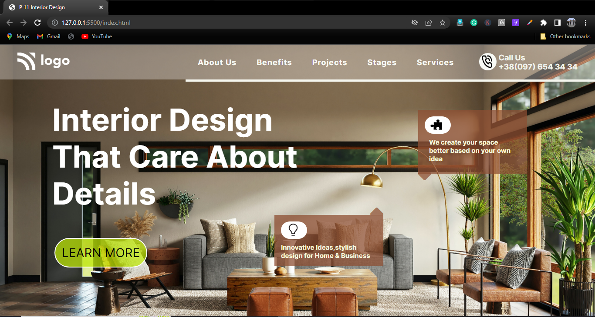
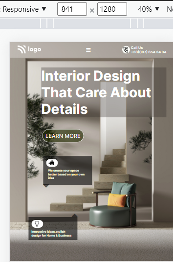
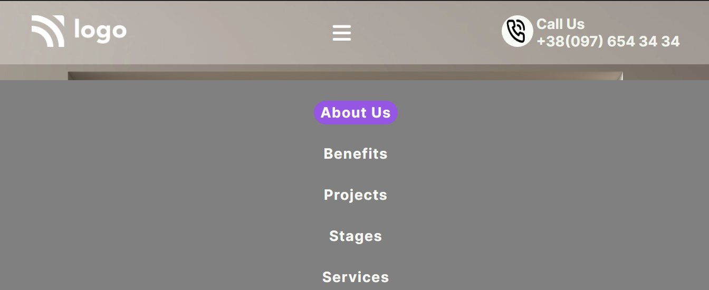

# Project 10 : Interior Design  Landing Page

- Click here for live demo of the Project on [ NETLIFY ](https://parikshitproject2.netlify.app/ "Parikshit Project 1")

 

###  This Project is build using HTML & CSS  

<b> Note: </b>  This Project is Mobile Responisive but not to all the devices. 
 -In our Project the Media Query Targets  the particular viewport range.
 
we will get a deeper dive into the concept of Responsive Design in coming Projects.
***

 

 

>Knowledge gained :

 

### 

>Below are the images of the my Project :-

- <b>Image 1 </b> : Interior Design Landing Page :-

   

- <b>Image 2 </b> : when we shrink the Size of Page the below are the changes we can observe: 
          1. Menu Buton Appears in place of Navigation Bar.
          2. Images,Text and button size Adjusted and Colors also changes.
          3. Background Image Changes.

   

- <b>Image 3 </b> : When we click on the Menu Button the Navigation Bar Appears from left hand side and covers the screen.
 

    

***

### Time Taken To Complete This Project : 7 hours

***

 

>The project is a part of the learning from  [ Sir Hitesh Choudhary's ](https://github.com/hiteshchoudhary) course on FULL STACK JAVASCRIPT WEB DEVELOPER. The idea credit is his. I have understood the concepts and learned them by building this on my own with a bare minimum reference of source code (only when my efforts couldn't clear the roadblock). The way of execution is modified as per my viewpoint whenever is necessary.

